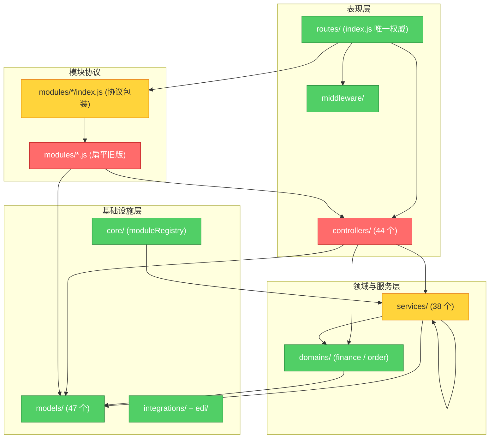

# Brooks-Lint Review

**Mode:** Architecture Audit
**Scope:** `backend/src` 全量（44 controllers / 38 services / 47 models / 13 modules / domains / core / middleware）
**Health Score:** 53/100

**Trend:** 首次 Architecture Audit — no trend data

单体架构总体分层清晰（routes → controllers → services → models），且已建立 `domains/` 领域收口与 `core/moduleRegistry` 插件协议两套正向演进，但控制器层大规模直连模型、财务控制器聚合逻辑重复、以及模块协议半迁移这三点，让"分层规则"在执行层面并不一致。

---

## Module Dependency Graph

---

## Findings

### 🔴 Critical

**Dependency Disorder — 控制器直连模型，绕过服务层（44 处）**
Symptom: `grep require('../models')` 在 `controllers/` 命中 44 处、覆盖 35 个控制器文件，其中 `financeController.js` 4 处、`orderController.js` 4 处、`documentController.js` 2 处。与此同时 E6/E7 已为 finance/order 建立 `domains/` facade（`financeService.js`、`orderDomain.js`），但控制器仍绕过它直接对模型做聚合与写操作。
Source: Martin — Clean Architecture, Dependency Inversion Principle (DIP) / Stable Dependencies Principle (SDP); Brooks — The Mythical Man-Month, Conceptual Integrity
Consequence: 同一领域存在两条互相独立的数据访问路径（controller 直连 model 与 service/domain facade）。未来一旦在 service 层加缓存、审计、事务或数据范围统一逻辑，直连路径会静默漏掉；修一处漏一处的行为让"架构规则"不可信，新开发者无法判断该走哪条路。
Remedy: 将 `financeController` 与 `orderController` 中直连模型的聚合与写逻辑下沉到对应 `domains/` facade（复用已存在的 `findRecordsForAggregation`、`autoCreateReceivable` 等），控制器只保留 HTTP 编排；随后在 `.eslintrc.js` 增加 `no-restricted-imports`，禁止 controllers 直接 `require('../models')`（与已有 FinanceRecord/AuditLog 禁令同模式），把规则从"约定"升级为"强制"。

**Domain Model Distortion — 财务 God Controller，聚合逻辑滞留表现层**
Symptom: `financeController.js` 623 行，是仓库最大文件，含 12 处对 `FinanceRecord` 的直接聚合调用（`.sum`/`.findAll`/`.aggregate`），承担应收汇总、账龄、期间汇总、月度趋势等多套财务聚合，而这些聚合与 `domains/finance/financeService.js` 已收口的查询能力高度重叠。
Source: Fowler — Refactoring, Data Class / Feature Envy; Evans — Domain-Driven Design, Anemic Domain Model
Consequence: 财务金额/期间/账期这类高规则密度逻辑散落在表现层，无法独立单元测试（测试必须起 DB），也无法在服务层复用。账期、汇率、audit 等横切关注点一旦被绕过，财务数据一致性风险集中在单个文件里，改动互相牵连。
Remedy: 按"每个聚合一个方法"把 `financeController` 里的聚合逻辑平移进 `domains/finance/financeService.js`，控制器改为调用 facade 方法；对每个平移的聚合补一个纯查询单元测试（复用 `financeService.test.js` 的 mock 模式），把 623 行压缩到编排层规模。

### 🟡 Warning

**Knowledge Duplication — 路由双轨，模块协议半迁移**
Symptom: `server.js` 注释明确"业务路由的唯一权威来源仍是 `src/routes/index.js`"，但 `modules/*.js`（扁平旧版）内仍完整定义了各自的 `routes()`（如 `order.js` 定义订单/箱号/放单/流程节点全套路由），并被 `modules/*/index.js`（协议包装）通过 `legacyModule.routes` 引用。13 个模块目录中仅 `qingdao-port` 与 `notification` 真正由 `mountRoutes` 挂载（autoMount 非 false），其余 12 个（auth/booking/customer/customs/document/finance/integration/order/port/quotation/supplier/tracking）均为 autoMount:false 的薄包装。
Source: Fowler — Refactoring, Duplicate Code; Hunt & Thomas — The Pragmatic Programmer, DRY
Consequence: 同一份路由定义存在两份（`routes/index.js` 与扁平模块的 `routes()`），虽因 autoMount:false 未造成实际重复挂载，但维护者改路由时不知道哪份是权威，排障时"模块协议"与"全局路由表"两套心智模型并存。
Remedy: 二选一并固化：要么把存量 12 个模块的 `routes()` 从扁平文件删除，仅保留 `models/menu/events/dependencies` 等元信息（routes 唯一权威为 `routes/index.js`）；要么反过来把路由全部迁入模块协议、让 `routes/index.js` 回归纯装配。建议前者（改动小、不破坏现有路由表），删除后更新 `modules/README.md` 明确协议定位。

**Accidental Complexity — 模块协议名存实亡，薄壳多于真插件**
Symptom: `modules/` 下 13 个子目录，其中 12 个 `index.js` 只是 `require('../xxx.js')` + 转发 `models/routes/menu/events` 的 15 行薄壳，真正实现仍在扁平文件或 controllers；仅 `notification`、`qingdao-port` 具备独立实现与自动挂载。`services/moduleRegistry.js` 又作为一个转发层把 `core/moduleRegistry.js` 再包一层。
Source: Fowler — Refactoring, Middle Man / Lazy Class; Ousterhout — A Philosophy of Software Design, Ch. 3 Tactical vs Strategic Programming
Consequence: 插件协议的核心价值（独立开发、按需启用、故障隔离）当前只有 2 个真实受益者，其余 12 个是"为迁而迁"的包装，增加了理解成本却未带来解耦收益——协议层比它实际支撑的插件还要复杂。
Remedy: 明确协议边界：`modules/` 只放"真插件"（有独立实现、可独立启停的类型，如 qingdao/notification），存量 CRUD 模块不再用薄壳包装，直接由 `routes/index.js` + controllers 承担；删除 12 个薄壳 `index.js` 及其对扁平文件的转发，避免维护两套模块清单。

**Testability Seam — 控制器层无 seam，业务逻辑只能集成测试**
Symptom: 控制器直连 `models`（见 Critical 1），意味着 `financeController` 的账龄、汇总、期间逻辑无法在单测中替换数据源——必须起 PostgreSQL 才能测，而 `domains/finance/financeService.js` 已具备可注入 seam（有 `financeService.test.js` 纯单测）。表现层与领域层的可测性呈现断层。
Source: Feathers — Working Effectively with Legacy Code, Ch. 4 The Seam Model
Consequence: 越往上（表现层）逻辑越难独立验证，测试金字塔仍然倒置；新增财务聚合只能靠昂贵、慢速的集成测试兜底，反馈回路拉长。
Remedy: 随 Critical 1 的聚合下沉，财务领域的业务判断全部收敛到有 seam 的 `domains/` 层并配单测；控制器退化为"解析参数 → 调用 facade → 格式化响应"的薄壳，使每个新聚合默认落在可单测的领域层。

### 🟢 Suggestion

**Dependency Disorder — 服务层互引偏密但无循环**
Symptom: `services/` 内部存在 cross-service 引用：`alertService` → `ruleEngineService`、`automationService` → `orderService`、`orderService` → `domains/order/orderDomain`、`currencyService` → `externalService`、`trackingAutoPull` → `alertService`，但未发现 A↔B 双向循环。
Source: Martin — Clean Architecture, Interface Segregation Principle (ISP)
Consequence: 无循环（已由 `topoSort` 与人工核对确认），健康；但服务间横向依赖较多，个别服务职责边界不够单一。
Remedy: 保持现状即可，仅在新增服务间依赖时先确认是否应下沉到 `domains/` 共享能力，避免服务层进一步横向缠绕。

**Knowledge Duplication — 兼容转发层残留**
Symptom: `services/moduleRegistry.js` 仅做 `require('../core/moduleRegistry')` 转发，意在兼容旧调用点。
Source: Fowler — Refactoring, Middle Man
Consequence: 多一层转发增加一次跳转，收益有限。
Remedy: 全仓替换旧 `require('../services/moduleRegistry')` 为 `require('../core/moduleRegistry')` 后删除转发文件（触发点很少，可安全清理）。

---

## Summary

最重要的动作是**把控制器直连模型收口到 `domains/` 层并用 ESLint 强制**——这同时解决 Critical 1（依赖无序）、Critical 2（God Controller）与 Testability Seam 三个问题，是一处投资多处收益的改动。整体趋势是：架构已具备正向的领域收口与插件协议雏形，但半数能力处于"建了没用"的半迁移状态，导致分层规则在执行层不一致；建议先完成财务/订单两个高价值域的收口与强制约束，再决定模块协议是彻底落地还是回退为"真插件专用"。